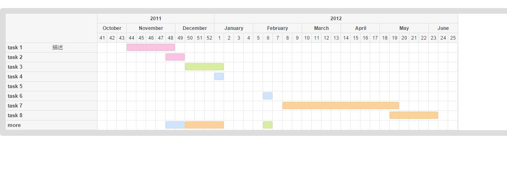
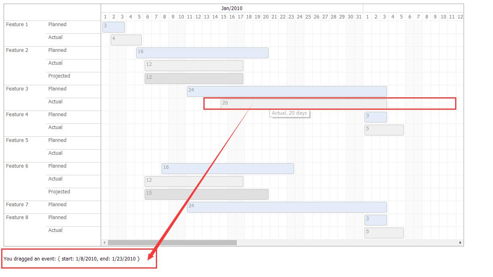

# 甘特图  jQuery.Gantt
 
**如有帮助谢谢star**   :star::star::star::star::star:


## test1介绍
 
 - 下载地址：https://github.com/ybx13579/jQuery.Gantt
 - 整理部分指南：http://blog.csdn.net/yangbingx/article/details/73470030
 - 官网：http://taitems.github.io/jQuery.Gantt


 
-
 

 
 - 概述：JQuery.Gantt是一个开源的基于JQuery库的用于实现甘特图效果的可扩展功能的JS组件库。
 - 缺点：目前用到的只是直接后台取数据渲染，图内不可拖动更改  
 - PS：如不需要按钮组，可用css隐藏
 - 每个数据节点可加弹窗 （前提：引用bootstrap 或 自定义样式）
 



 - 资源引用：首先我们需要将下载到的源码中的CSS、IMG、JS等资源放入我们自己的项目中，然后在我们自己的页面中引用需要的资源文件。
 
**步骤：**
 
1、CSS样式文件

`<link rel="stylesheet" href="css/style.css" />`


2、JS脚本文件

```
<script src="js/jquery-1.7.min.js"></script>
<script src="js/jquery.fn.gantt.js" charset ="GB2312"></script>
```

**注：如果需要甘特图中显示中文，则需要在js文件引用中加上charset特性并设置为GB2312，否则中文内容将显示为乱码。**

3、在需要显示甘特图的地方加入以下这个div。

```
<div class="gantt"></div>
```


## test2介绍
 
 - 每个节点有拖拽效果
 - 效果图：
 
 
 
 
 

